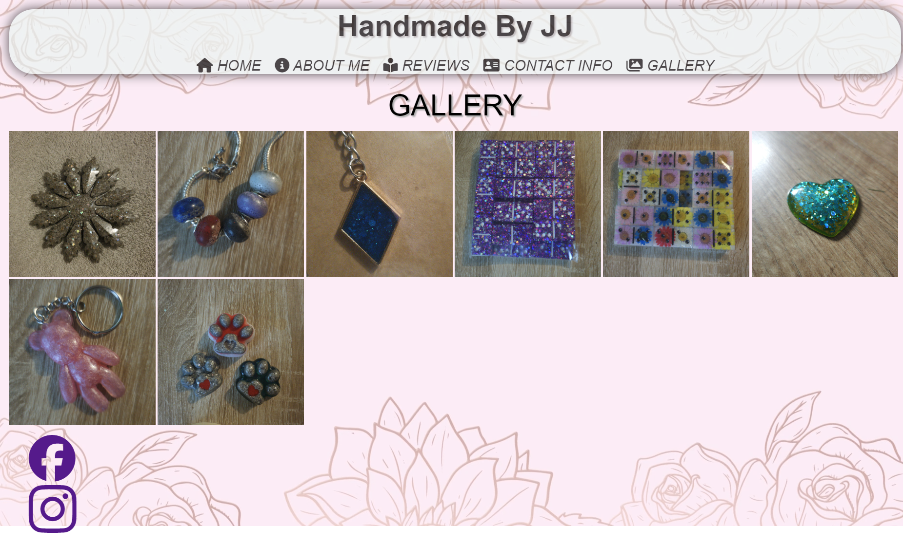
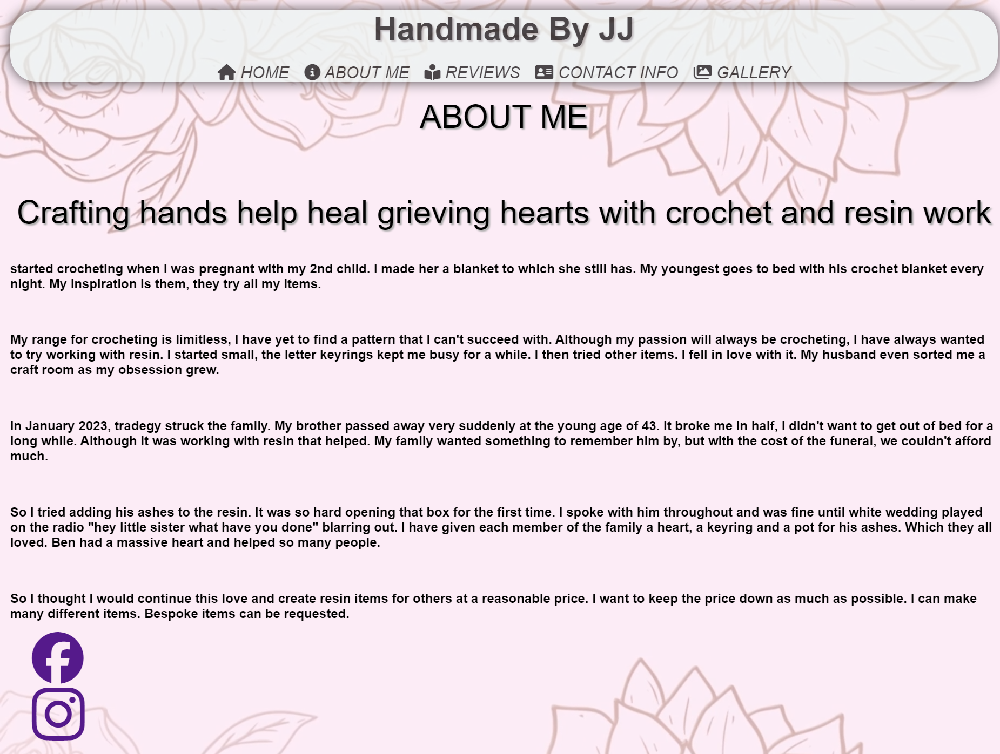
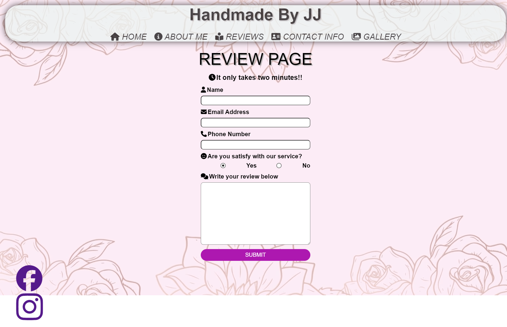
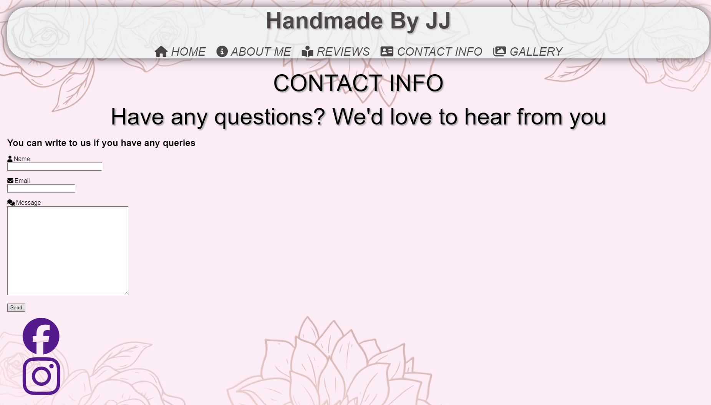
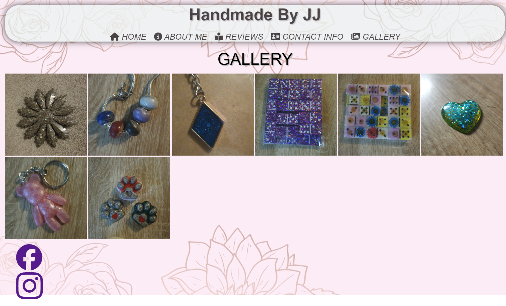

<h1>Handmade By JJ <h2>(www.handmadebyjj.co.uk)</h2></h1> 

Handmade by JJ is a website that was created to show the arts and crafts that are on offer. Handmade by JJ offers a range of items from initial resin keyrings to items made using the ashes of loved ones or pets. By using this website, users wil be redirected to an etsy shop and then can complete their purchses through the shop. 

<h2><strong>Features</strong></h2>

<ul>
  <li><strong>HOME</strong></li>
   
    
The Home Page is where you click on the handmade items, and by clicking the appropriate link will redirect the customer to the ETSY page.

    
  
  <li><strong>ABOUT ME</strong></li>
   
    
The About page is the story on why my wife got into crafts.

    
  
  <li><strong>REVIEWS</strong></li>
   
    
The Review Page is for customers to leave reveiws and in future to have a link to the etsy page review section, this will be used to show all the different reviews received through etsy.

    
  
  <li><strong>CONTACT INFO</strong></li>
   
  
The Contact Page is made assessable so that the customer can email any questions they have have about the products.

  
  
  <li><strong>GALLERY</strong></li>
   
  
The Gallery is for showcasing pictures of all the items the creator has made, this could give someone the opportunity to request bespoke items if they are shown in the gallery even if not currently available in the shop. 

  

  <li><strong>FACEBOOK AND INSTAGRAM</strong></li>
   
  
These are links at the bottom of the page to handmade by jj social media sites

</ul>

<h2>Testing</h2>

  <ul>
    <li>I have confirmed that by adding the contact info and reviews, the information will be sent via an email to the creator of the products.</li>
     
    <li>I have checked my website on different phone screens and used phone emulator websites.</li>
     
    <li>No errors were returned when passing through the official W3C (HTML) validator</li>
    
  </ul>

  
